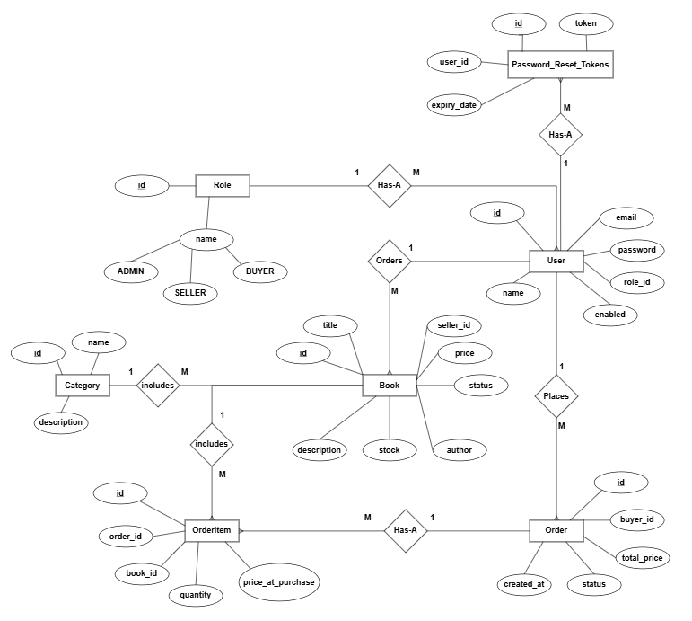

## Overview

**ScholarHaven** is a secure, role-based online book marketplace built to demonstrate professional software engineering practices.

It combines a Spring Boot backend, Thymeleaf server-rendered UI, PostgreSQL relational database, Spring Security (RBAC), Docker containerization, and a CI/CD pipeline using GitHub Actions with deployment on Render.

## Key features

- **Authentication & Authorization**: registration, login/logout, BCrypt password hashing, role-based access control (Admin, Seller, Buyer)
- **Book management**: sellers can create and manage listings, admins can moderate listings, buyers can browse and view details
- **Orders**: buyers place orders and view order history, admins can manage order statuses
- **Password reset**: time-limited, single-use reset tokens stored in a dedicated table

## User roles

| Role | Capabilities |
| --- | --- |
| **Admin** | Manage all users, approve/remove book listings, update order statuses |
| **Seller** | Add, edit, delete own listings, view orders for own books |
| **Buyer** | Browse listings, manage cart, place orders, view order history |

## Tech stack

| Layer | Technology |
| --- | --- |
| Language | Java 17 |
| Backend | Spring Boot 3.x |
| Security | Spring Security, BCrypt |
| Frontend | Thymeleaf |
| Database | PostgreSQL, JPA/Hibernate |
| Testing | JUnit 5, Mockito, SpringBootTest, MockMvc |
| Containerization | Docker, Docker Compose |
| CI/CD | GitHub Actions |
| Deployment | Render |

## Architecture

> 📌 Architecture diagram coming soon — `docs/architecture.png` will be added shortly.

## CI/CD flow

```
Push to main
    │
    ▼
┌─────────────────────────────────────────┐
│  CI — Build & Test                      │
│  1. Checkout repository                 │
│  2. Set up JDK 17                       │
│  3. Provision PostgreSQL service        │
│  4. Run: mvn clean verify               │
│  ✘ Pipeline fails if any test fails    │
└─────────────────────────────────────────┘
    │  (main branch only)
    ▼
┌─────────────────────────────────────────┐
│  CD — Deploy to Render                  │
│  5. Trigger Render deployment via API   │
│  6. Application goes live ✅            │
└─────────────────────────────────────────┘
```

## Database design

### Entity relationship overview

Core entities include: `User`, `Role`, `Book`, `Order`, `OrderItem`, `PasswordResetToken`, `Category`.

### ER diagram



[Download ER Diagram PDF](docs/er-diagram.pdf)

### Password reset token table (design note)

The `password_reset_tokens` table is intentionally separate from `users` to keep the user record clean and persist reset data only when needed.

| Field | Type | Description |
| --- | --- | --- |
| `id` | Primary key | Auto-generated identifier |
| `token` | `VARCHAR` (UUID) | Unique cryptographically random reset token |
| `user_id` | FK → `users.id` | User who initiated the reset |
| `expiry_date` | `TIMESTAMP` | Token expiration time (for example, 24 hours) |

## REST API

Base paths below match the project's API grouping.

### Auth — `/api/auth`

| Method | Endpoint | Description | Access |
| --- | --- | --- | --- |
| `POST` | `/register` | Register a new user account | Public |
| `POST` | `/login` | Authenticate and receive session/token | Public |
| `POST` | `/forgot-password` | Request a password reset token | Public |
| `POST` | `/reset-password` | Submit a new password with a reset token | Public |

### Books — `/api/books`

| Method | Endpoint | Description | Access |
| --- | --- | --- | --- |
| `GET` | `/` | List all available book listings | Public |
| `GET` | `/{id}` | Get a single book by ID | Public |
| `POST` | `/` | Create a new listing | Seller |
| `PUT` | `/{id}` | Update a listing | Seller (owner) or Admin |
| `DELETE` | `/{id}` | Remove a listing | Seller (owner) or Admin |

### Orders — `/api/orders`

| Method | Endpoint | Description | Access |
| --- | --- | --- | --- |
| `POST` | `/` | Place a new order | Buyer |
| `GET` | `/my` | Get the authenticated buyer's orders | Buyer |
| `GET` | `/{id}` | Get a specific order's details | Buyer or Admin |
| `PATCH` | `/{id}/status` | Update order status | Admin |

## Testing

- **Unit tests** (service layer): JUnit 5 and Mockito
- **Integration tests** (controller layer): `@SpringBootTest` and `MockMvc`

Minimum targets in the spec: **15 unit tests** and **3 integration tests**.

## Run locally

### Option A: Docker Compose (recommended)

```bash
docker compose up --build
```

This builds the app image and starts both the application and PostgreSQL.

### Environment variables

Use environment variables for database configuration and any deployment secrets. Do not hardcode credentials.

## CI/CD

The repository uses GitHub Actions to:

- Build the project
- Run tests
- Deploy to Render on `main` branch updates

### Required GitHub Secrets

| Secret Key | Description |
| --- | --- |
| `DB_USERNAME` | PostgreSQL database username |
| `DB_PASSWORD` | PostgreSQL database password |
| `DB_NAME` | PostgreSQL database name |
| `RENDER_API_KEY` | Render deployment API key |

## Git workflow

Recommended branch strategy:

- `main`: protected, production-ready, deploys to Render
- `develop`: integration branch
- `feature/*`: feature work

Branch protection rules should block direct pushes to `main` and require at least one PR approval, with CI checks passing before merge.

## Links

- Repository: [https://github.com/zunaiednudar/scholarhaven](https://github.com/zunaiednudar/scholarhaven)
- Deployment URL: [https://scholarhaven.onrender.com](https://scholarhaven.onrender.com)
